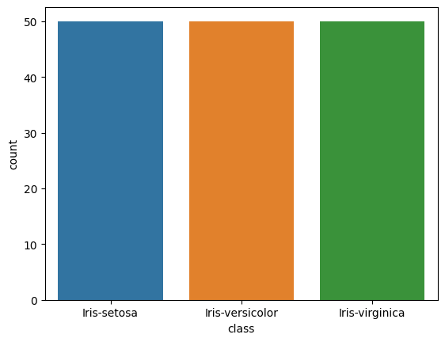
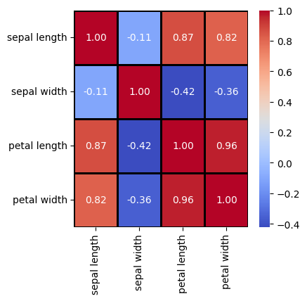

# Lista 1


## Wczytanie zbioru IRIS, Wine, GLASS 

Zaimportowanie potrzebnych bibliotek...


```python

from ucimlrepo import fetch_ucirepo 
import pandas as pd
import seaborn as sns
import matplotlib.pyplot as plt
from sklearn import decomposition
import numpy as np

```

Wczytanie zbioru IRIS będący zbiorem danych dotyczącym 3 gatunków irysów: setosa, versicolor, virginica. 
Atrybutami są:
* długość kielicha
* szerokość kielicha
* długość płatka
* szerokość płatka

Wypisanie pierwszych 20 wierszy zbioru danych.


```python
iris = fetch_ucirepo(id=53)
  
iris_X = iris.data.features 
iris_y = iris.data.targets 

iris_df = pd.concat([iris_X, iris_y], axis=1)  

iris_df.head(20)
```


<div>
<style scoped>
    .dataframe tbody tr th:only-of-type {
        vertical-align: middle;
    }

    .dataframe tbody tr th {
        vertical-align: top;
    }

    .dataframe thead th {
        text-align: right;
    }
</style>
<table border="1" class="dataframe">
  <thead>
    <tr style="text-align: right;">
      <th></th>
      <th>sepal length</th>
      <th>sepal width</th>
      <th>petal length</th>
      <th>petal width</th>
      <th>class</th>
    </tr>
  </thead>
  <tbody>
    <tr>
      <th>0</th>
      <td>5.1</td>
      <td>3.5</td>
      <td>1.4</td>
      <td>0.2</td>
      <td>Iris-setosa</td>
    </tr>
    <tr>
      <th>1</th>
      <td>4.9</td>
      <td>3.0</td>
      <td>1.4</td>
      <td>0.2</td>
      <td>Iris-setosa</td>
    </tr>
    <tr>
      <th>2</th>
      <td>4.7</td>
      <td>3.2</td>
      <td>1.3</td>
      <td>0.2</td>
      <td>Iris-setosa</td>
    </tr>
    <tr>
      <th>3</th>
      <td>4.6</td>
      <td>3.1</td>
      <td>1.5</td>
      <td>0.2</td>
      <td>Iris-setosa</td>
    </tr>
    <tr>
      <th>4</th>
      <td>5.0</td>
      <td>3.6</td>
      <td>1.4</td>
      <td>0.2</td>
      <td>Iris-setosa</td>
    </tr>
    <tr>
      <th>5</th>
      <td>5.4</td>
      <td>3.9</td>
      <td>1.7</td>
      <td>0.4</td>
      <td>Iris-setosa</td>
    </tr>
    <tr>
      <th>6</th>
      <td>4.6</td>
      <td>3.4</td>
      <td>1.4</td>
      <td>0.3</td>
      <td>Iris-setosa</td>
    </tr>
    <tr>
      <th>7</th>
      <td>5.0</td>
      <td>3.4</td>
      <td>1.5</td>
      <td>0.2</td>
      <td>Iris-setosa</td>
    </tr>
    <tr>
      <th>8</th>
      <td>4.4</td>
      <td>2.9</td>
      <td>1.4</td>
      <td>0.2</td>
      <td>Iris-setosa</td>
    </tr>
    <tr>
      <th>9</th>
      <td>4.9</td>
      <td>3.1</td>
      <td>1.5</td>
      <td>0.1</td>
      <td>Iris-setosa</td>
    </tr>
    <tr>
      <th>10</th>
      <td>5.4</td>
      <td>3.7</td>
      <td>1.5</td>
      <td>0.2</td>
      <td>Iris-setosa</td>
    </tr>
    <tr>
      <th>11</th>
      <td>4.8</td>
      <td>3.4</td>
      <td>1.6</td>
      <td>0.2</td>
      <td>Iris-setosa</td>
    </tr>
    <tr>
      <th>12</th>
      <td>4.8</td>
      <td>3.0</td>
      <td>1.4</td>
      <td>0.1</td>
      <td>Iris-setosa</td>
    </tr>
    <tr>
      <th>13</th>
      <td>4.3</td>
      <td>3.0</td>
      <td>1.1</td>
      <td>0.1</td>
      <td>Iris-setosa</td>
    </tr>
    <tr>
      <th>14</th>
      <td>5.8</td>
      <td>4.0</td>
      <td>1.2</td>
      <td>0.2</td>
      <td>Iris-setosa</td>
    </tr>
    <tr>
      <th>15</th>
      <td>5.7</td>
      <td>4.4</td>
      <td>1.5</td>
      <td>0.4</td>
      <td>Iris-setosa</td>
    </tr>
    <tr>
      <th>16</th>
      <td>5.4</td>
      <td>3.9</td>
      <td>1.3</td>
      <td>0.4</td>
      <td>Iris-setosa</td>
    </tr>
    <tr>
      <th>17</th>
      <td>5.1</td>
      <td>3.5</td>
      <td>1.4</td>
      <td>0.3</td>
      <td>Iris-setosa</td>
    </tr>
    <tr>
      <th>18</th>
      <td>5.7</td>
      <td>3.8</td>
      <td>1.7</td>
      <td>0.3</td>
      <td>Iris-setosa</td>
    </tr>
    <tr>
      <th>19</th>
      <td>5.1</td>
      <td>3.8</td>
      <td>1.5</td>
      <td>0.3</td>
      <td>Iris-setosa</td>
    </tr>
  </tbody>
</table>
</div>


Wczytanie zbioru GLASS, który zawiera dane dotyczące sześciu klas szkła. 
Atrybutami są:
* RI: współczynnik załamania światła
* Na: zawartość sodu
* Mg: zawartość magnezu
* Al: zawartość glinu
* Si: zawartość krzemu
* K: zawartość potasu
* Ca: zawartość wapnia
* Ba: zawartość baru
* Fe: zawartość żelaza

Wypisanie pierwszych 20 wierszy zbioru danych.


```python
glass_identification = fetch_ucirepo(id=42) 
  
glass_X = glass_identification.data.features 
glass_y = glass_identification.data.targets 
  
glass_df = pd.concat([glass_X, glass_y], axis=1)

glass_df.head(20)
```


<div>
<style scoped>
    .dataframe tbody tr th:only-of-type {
        vertical-align: middle;
    }

    .dataframe tbody tr th {
        vertical-align: top;
    }

    .dataframe thead th {
        text-align: right;
    }
</style>
<table border="1" class="dataframe">
  <thead>
    <tr style="text-align: right;">
      <th></th>
      <th>RI</th>
      <th>Na</th>
      <th>Mg</th>
      <th>Al</th>
      <th>Si</th>
      <th>K</th>
      <th>Ca</th>
      <th>Ba</th>
      <th>Fe</th>
      <th>Type_of_glass</th>
    </tr>
  </thead>
  <tbody>
    <tr>
      <th>0</th>
      <td>1.52101</td>
      <td>13.64</td>
      <td>4.49</td>
      <td>1.10</td>
      <td>71.78</td>
      <td>0.06</td>
      <td>8.75</td>
      <td>0.0</td>
      <td>0.00</td>
      <td>1</td>
    </tr>
    <tr>
      <th>1</th>
      <td>1.51761</td>
      <td>13.89</td>
      <td>3.60</td>
      <td>1.36</td>
      <td>72.73</td>
      <td>0.48</td>
      <td>7.83</td>
      <td>0.0</td>
      <td>0.00</td>
      <td>1</td>
    </tr>
    <tr>
      <th>2</th>
      <td>1.51618</td>
      <td>13.53</td>
      <td>3.55</td>
      <td>1.54</td>
      <td>72.99</td>
      <td>0.39</td>
      <td>7.78</td>
      <td>0.0</td>
      <td>0.00</td>
      <td>1</td>
    </tr>
    <tr>
      <th>3</th>
      <td>1.51766</td>
      <td>13.21</td>
      <td>3.69</td>
      <td>1.29</td>
      <td>72.61</td>
      <td>0.57</td>
      <td>8.22</td>
      <td>0.0</td>
      <td>0.00</td>
      <td>1</td>
    </tr>
    <tr>
      <th>4</th>
      <td>1.51742</td>
      <td>13.27</td>
      <td>3.62</td>
      <td>1.24</td>
      <td>73.08</td>
      <td>0.55</td>
      <td>8.07</td>
      <td>0.0</td>
      <td>0.00</td>
      <td>1</td>
    </tr>
    <tr>
      <th>5</th>
      <td>1.51596</td>
      <td>12.79</td>
      <td>3.61</td>
      <td>1.62</td>
      <td>72.97</td>
      <td>0.64</td>
      <td>8.07</td>
      <td>0.0</td>
      <td>0.26</td>
      <td>1</td>
    </tr>
    <tr>
      <th>6</th>
      <td>1.51743</td>
      <td>13.30</td>
      <td>3.60</td>
      <td>1.14</td>
      <td>73.09</td>
      <td>0.58</td>
      <td>8.17</td>
      <td>0.0</td>
      <td>0.00</td>
      <td>1</td>
    </tr>
    <tr>
      <th>7</th>
      <td>1.51756</td>
      <td>13.15</td>
      <td>3.61</td>
      <td>1.05</td>
      <td>73.24</td>
      <td>0.57</td>
      <td>8.24</td>
      <td>0.0</td>
      <td>0.00</td>
      <td>1</td>
    </tr>
    <tr>
      <th>8</th>
      <td>1.51918</td>
      <td>14.04</td>
      <td>3.58</td>
      <td>1.37</td>
      <td>72.08</td>
      <td>0.56</td>
      <td>8.30</td>
      <td>0.0</td>
      <td>0.00</td>
      <td>1</td>
    </tr>
    <tr>
      <th>9</th>
      <td>1.51755</td>
      <td>13.00</td>
      <td>3.60</td>
      <td>1.36</td>
      <td>72.99</td>
      <td>0.57</td>
      <td>8.40</td>
      <td>0.0</td>
      <td>0.11</td>
      <td>1</td>
    </tr>
    <tr>
      <th>10</th>
      <td>1.51571</td>
      <td>12.72</td>
      <td>3.46</td>
      <td>1.56</td>
      <td>73.20</td>
      <td>0.67</td>
      <td>8.09</td>
      <td>0.0</td>
      <td>0.24</td>
      <td>1</td>
    </tr>
    <tr>
      <th>11</th>
      <td>1.51763</td>
      <td>12.80</td>
      <td>3.66</td>
      <td>1.27</td>
      <td>73.01</td>
      <td>0.60</td>
      <td>8.56</td>
      <td>0.0</td>
      <td>0.00</td>
      <td>1</td>
    </tr>
    <tr>
      <th>12</th>
      <td>1.51589</td>
      <td>12.88</td>
      <td>3.43</td>
      <td>1.40</td>
      <td>73.28</td>
      <td>0.69</td>
      <td>8.05</td>
      <td>0.0</td>
      <td>0.24</td>
      <td>1</td>
    </tr>
    <tr>
      <th>13</th>
      <td>1.51748</td>
      <td>12.86</td>
      <td>3.56</td>
      <td>1.27</td>
      <td>73.21</td>
      <td>0.54</td>
      <td>8.38</td>
      <td>0.0</td>
      <td>0.17</td>
      <td>1</td>
    </tr>
    <tr>
      <th>14</th>
      <td>1.51763</td>
      <td>12.61</td>
      <td>3.59</td>
      <td>1.31</td>
      <td>73.29</td>
      <td>0.58</td>
      <td>8.50</td>
      <td>0.0</td>
      <td>0.00</td>
      <td>1</td>
    </tr>
    <tr>
      <th>15</th>
      <td>1.51761</td>
      <td>12.81</td>
      <td>3.54</td>
      <td>1.23</td>
      <td>73.24</td>
      <td>0.58</td>
      <td>8.39</td>
      <td>0.0</td>
      <td>0.00</td>
      <td>1</td>
    </tr>
    <tr>
      <th>16</th>
      <td>1.51784</td>
      <td>12.68</td>
      <td>3.67</td>
      <td>1.16</td>
      <td>73.11</td>
      <td>0.61</td>
      <td>8.70</td>
      <td>0.0</td>
      <td>0.00</td>
      <td>1</td>
    </tr>
    <tr>
      <th>17</th>
      <td>1.52196</td>
      <td>14.36</td>
      <td>3.85</td>
      <td>0.89</td>
      <td>71.36</td>
      <td>0.15</td>
      <td>9.15</td>
      <td>0.0</td>
      <td>0.00</td>
      <td>1</td>
    </tr>
    <tr>
      <th>18</th>
      <td>1.51911</td>
      <td>13.90</td>
      <td>3.73</td>
      <td>1.18</td>
      <td>72.12</td>
      <td>0.06</td>
      <td>8.89</td>
      <td>0.0</td>
      <td>0.00</td>
      <td>1</td>
    </tr>
    <tr>
      <th>19</th>
      <td>1.51735</td>
      <td>13.02</td>
      <td>3.54</td>
      <td>1.69</td>
      <td>72.73</td>
      <td>0.54</td>
      <td>8.44</td>
      <td>0.0</td>
      <td>0.07</td>
      <td>1</td>
    </tr>
  </tbody>
</table>
</div>


Wczytanie zbioru Wine zawierającego dane dotyczące 3 klas wina.
Atrybutami są:
* Alcohol - zawartość alkoholu
* Malic acid - kwas jabłkowy
* Ash - popiół
* Alcalinity of ash - zasadowość popiołu
* Magnesium - magnez
* Total phenols - całkowita zawartość fenoli
* Flavanoids - flawonoidy
* Nonflavanoid phenols - nieflawonoidowe fenole
* Proanthocyanins - proantocyjanidyny
* Color intensity - intensywność koloru
* Hue - barwa
* OD280/OD315 of diluted wines - stosunek absorbancji
* Proline - prolin

Wypisanie pierwszych 20 wierszy zbioru danych.


```python
wine = fetch_ucirepo(id=109) 
  
wine_X = wine.data.features 
wine_y = wine.data.targets 
  
wine_df = pd.concat([wine_X, wine_y], axis=1)

wine_df.head(20)
```


<div>
<style scoped>
    .dataframe tbody tr th:only-of-type {
        vertical-align: middle;
    }

    .dataframe tbody tr th {
        vertical-align: top;
    }

    .dataframe thead th {
        text-align: right;
    }
</style>
<table border="1" class="dataframe">
  <thead>
    <tr style="text-align: right;">
      <th></th>
      <th>Alcohol</th>
      <th>Malicacid</th>
      <th>Ash</th>
      <th>Alcalinity_of_ash</th>
      <th>Magnesium</th>
      <th>Total_phenols</th>
      <th>Flavanoids</th>
      <th>Nonflavanoid_phenols</th>
      <th>Proanthocyanins</th>
      <th>Color_intensity</th>
      <th>Hue</th>
      <th>0D280_0D315_of_diluted_wines</th>
      <th>Proline</th>
      <th>class</th>
    </tr>
  </thead>
  <tbody>
    <tr>
      <th>0</th>
      <td>14.23</td>
      <td>1.71</td>
      <td>2.43</td>
      <td>15.6</td>
      <td>127</td>
      <td>2.80</td>
      <td>3.06</td>
      <td>0.28</td>
      <td>2.29</td>
      <td>5.64</td>
      <td>1.04</td>
      <td>3.92</td>
      <td>1065</td>
      <td>1</td>
    </tr>
    <tr>
      <th>1</th>
      <td>13.20</td>
      <td>1.78</td>
      <td>2.14</td>
      <td>11.2</td>
      <td>100</td>
      <td>2.65</td>
      <td>2.76</td>
      <td>0.26</td>
      <td>1.28</td>
      <td>4.38</td>
      <td>1.05</td>
      <td>3.40</td>
      <td>1050</td>
      <td>1</td>
    </tr>
    <tr>
      <th>2</th>
      <td>13.16</td>
      <td>2.36</td>
      <td>2.67</td>
      <td>18.6</td>
      <td>101</td>
      <td>2.80</td>
      <td>3.24</td>
      <td>0.30</td>
      <td>2.81</td>
      <td>5.68</td>
      <td>1.03</td>
      <td>3.17</td>
      <td>1185</td>
      <td>1</td>
    </tr>
    <tr>
      <th>3</th>
      <td>14.37</td>
      <td>1.95</td>
      <td>2.50</td>
      <td>16.8</td>
      <td>113</td>
      <td>3.85</td>
      <td>3.49</td>
      <td>0.24</td>
      <td>2.18</td>
      <td>7.80</td>
      <td>0.86</td>
      <td>3.45</td>
      <td>1480</td>
      <td>1</td>
    </tr>
    <tr>
      <th>4</th>
      <td>13.24</td>
      <td>2.59</td>
      <td>2.87</td>
      <td>21.0</td>
      <td>118</td>
      <td>2.80</td>
      <td>2.69</td>
      <td>0.39</td>
      <td>1.82</td>
      <td>4.32</td>
      <td>1.04</td>
      <td>2.93</td>
      <td>735</td>
      <td>1</td>
    </tr>
    <tr>
      <th>5</th>
      <td>14.20</td>
      <td>1.76</td>
      <td>2.45</td>
      <td>15.2</td>
      <td>112</td>
      <td>3.27</td>
      <td>3.39</td>
      <td>0.34</td>
      <td>1.97</td>
      <td>6.75</td>
      <td>1.05</td>
      <td>2.85</td>
      <td>1450</td>
      <td>1</td>
    </tr>
    <tr>
      <th>6</th>
      <td>14.39</td>
      <td>1.87</td>
      <td>2.45</td>
      <td>14.6</td>
      <td>96</td>
      <td>2.50</td>
      <td>2.52</td>
      <td>0.30</td>
      <td>1.98</td>
      <td>5.25</td>
      <td>1.02</td>
      <td>3.58</td>
      <td>1290</td>
      <td>1</td>
    </tr>
    <tr>
      <th>7</th>
      <td>14.06</td>
      <td>2.15</td>
      <td>2.61</td>
      <td>17.6</td>
      <td>121</td>
      <td>2.60</td>
      <td>2.51</td>
      <td>0.31</td>
      <td>1.25</td>
      <td>5.05</td>
      <td>1.06</td>
      <td>3.58</td>
      <td>1295</td>
      <td>1</td>
    </tr>
    <tr>
      <th>8</th>
      <td>14.83</td>
      <td>1.64</td>
      <td>2.17</td>
      <td>14.0</td>
      <td>97</td>
      <td>2.80</td>
      <td>2.98</td>
      <td>0.29</td>
      <td>1.98</td>
      <td>5.20</td>
      <td>1.08</td>
      <td>2.85</td>
      <td>1045</td>
      <td>1</td>
    </tr>
    <tr>
      <th>9</th>
      <td>13.86</td>
      <td>1.35</td>
      <td>2.27</td>
      <td>16.0</td>
      <td>98</td>
      <td>2.98</td>
      <td>3.15</td>
      <td>0.22</td>
      <td>1.85</td>
      <td>7.22</td>
      <td>1.01</td>
      <td>3.55</td>
      <td>1045</td>
      <td>1</td>
    </tr>
    <tr>
      <th>10</th>
      <td>14.10</td>
      <td>2.16</td>
      <td>2.30</td>
      <td>18.0</td>
      <td>105</td>
      <td>2.95</td>
      <td>3.32</td>
      <td>0.22</td>
      <td>2.38</td>
      <td>5.75</td>
      <td>1.25</td>
      <td>3.17</td>
      <td>1510</td>
      <td>1</td>
    </tr>
    <tr>
      <th>11</th>
      <td>14.12</td>
      <td>1.48</td>
      <td>2.32</td>
      <td>16.8</td>
      <td>95</td>
      <td>2.20</td>
      <td>2.43</td>
      <td>0.26</td>
      <td>1.57</td>
      <td>5.00</td>
      <td>1.17</td>
      <td>2.82</td>
      <td>1280</td>
      <td>1</td>
    </tr>
    <tr>
      <th>12</th>
      <td>13.75</td>
      <td>1.73</td>
      <td>2.41</td>
      <td>16.0</td>
      <td>89</td>
      <td>2.60</td>
      <td>2.76</td>
      <td>0.29</td>
      <td>1.81</td>
      <td>5.60</td>
      <td>1.15</td>
      <td>2.90</td>
      <td>1320</td>
      <td>1</td>
    </tr>
    <tr>
      <th>13</th>
      <td>14.75</td>
      <td>1.73</td>
      <td>2.39</td>
      <td>11.4</td>
      <td>91</td>
      <td>3.10</td>
      <td>3.69</td>
      <td>0.43</td>
      <td>2.81</td>
      <td>5.40</td>
      <td>1.25</td>
      <td>2.73</td>
      <td>1150</td>
      <td>1</td>
    </tr>
    <tr>
      <th>14</th>
      <td>14.38</td>
      <td>1.87</td>
      <td>2.38</td>
      <td>12.0</td>
      <td>102</td>
      <td>3.30</td>
      <td>3.64</td>
      <td>0.29</td>
      <td>2.96</td>
      <td>7.50</td>
      <td>1.20</td>
      <td>3.00</td>
      <td>1547</td>
      <td>1</td>
    </tr>
    <tr>
      <th>15</th>
      <td>13.63</td>
      <td>1.81</td>
      <td>2.70</td>
      <td>17.2</td>
      <td>112</td>
      <td>2.85</td>
      <td>2.91</td>
      <td>0.30</td>
      <td>1.46</td>
      <td>7.30</td>
      <td>1.28</td>
      <td>2.88</td>
      <td>1310</td>
      <td>1</td>
    </tr>
    <tr>
      <th>16</th>
      <td>14.30</td>
      <td>1.92</td>
      <td>2.72</td>
      <td>20.0</td>
      <td>120</td>
      <td>2.80</td>
      <td>3.14</td>
      <td>0.33</td>
      <td>1.97</td>
      <td>6.20</td>
      <td>1.07</td>
      <td>2.65</td>
      <td>1280</td>
      <td>1</td>
    </tr>
    <tr>
      <th>17</th>
      <td>13.83</td>
      <td>1.57</td>
      <td>2.62</td>
      <td>20.0</td>
      <td>115</td>
      <td>2.95</td>
      <td>3.40</td>
      <td>0.40</td>
      <td>1.72</td>
      <td>6.60</td>
      <td>1.13</td>
      <td>2.57</td>
      <td>1130</td>
      <td>1</td>
    </tr>
    <tr>
      <th>18</th>
      <td>14.19</td>
      <td>1.59</td>
      <td>2.48</td>
      <td>16.5</td>
      <td>108</td>
      <td>3.30</td>
      <td>3.93</td>
      <td>0.32</td>
      <td>1.86</td>
      <td>8.70</td>
      <td>1.23</td>
      <td>2.82</td>
      <td>1680</td>
      <td>1</td>
    </tr>
    <tr>
      <th>19</th>
      <td>13.64</td>
      <td>3.10</td>
      <td>2.56</td>
      <td>15.2</td>
      <td>116</td>
      <td>2.70</td>
      <td>3.03</td>
      <td>0.17</td>
      <td>1.66</td>
      <td>5.10</td>
      <td>0.96</td>
      <td>3.36</td>
      <td>845</td>
      <td>1</td>
    </tr>
  </tbody>
</table>
</div>


## Analiza zbiorów IRIS, Wine, GLASS: klasy (liczba, interpretacja), instancje, atrybuty, dystrybucja klas w zbiorze. 

### IRIS

Wypisanie podstawowych informacji o danych ze zbioru IRIS.


```python
iris_df.info()
```

    <class 'pandas.core.frame.DataFrame'>
    RangeIndex: 150 entries, 0 to 149
    Data columns (total 5 columns):
     #   Column        Non-Null Count  Dtype  
    ---  ------        --------------  -----  
     0   sepal length  150 non-null    float64
     1   sepal width   150 non-null    float64
     2   petal length  150 non-null    float64
     3   petal width   150 non-null    float64
     4   class         150 non-null    object 
    dtypes: float64(4), object(1)
    memory usage: 6.0+ KB
    

Zbiór posiada 150 instancji, 4 atrybuty jedną etykietę. Typami atrybutów są liczby zmiennoprzecinkowe, zaś etykiety są typem `object`.
Zbiór nie posiada brakującyh danych. Jeżeli posiadałby musielibyśmy podjąć decyzję co z nimi zrobić. Czy usunąć, czy uzupełnić.

Przeanalizujmy czym są etykiety, jakie klasy występują w zbiorze oraz jakie jest ich rozkład.


```python
iris_df['class']
```


    0         Iris-setosa
    1         Iris-setosa
    2         Iris-setosa
    3         Iris-setosa
    4         Iris-setosa
                ...      
    145    Iris-virginica
    146    Iris-virginica
    147    Iris-virginica
    148    Iris-virginica
    149    Iris-virginica
    Name: class, Length: 150, dtype: object


```python
print(iris_df['class'].nunique())
```

    3
    


```python
print(iris_df['class'].value_counts())
```

    class
    Iris-setosa        50
    Iris-versicolor    50
    Iris-virginica     50
    Name: count, dtype: int64
    

Zbiór Iris zawiera 150 instancji, 4 atrybuty i 3 klasy. Klasy to: Iris-setosa, Iris-versicolor, Iris-virginica. Klasy są równomiernie rozłożone w zbiorze, po 50 instancji każda. Dystrybucja klas w zbiorze jest równomierna i wygląda następująco:


```python

sns.countplot(x='class', data=iris_df, hue='class')
plt.show()
```


    

    


Następnie możemy przyjrzeć się bliżej wartościom atrybutów. W tym celu wyświetlimy podstawowe statystyki dotyczące wartości atrybutów.


```python
iris_df.describe()
```


<div>
<style scoped>
    .dataframe tbody tr th:only-of-type {
        vertical-align: middle;
    }

    .dataframe tbody tr th {
        vertical-align: top;
    }

    .dataframe thead th {
        text-align: right;
    }
</style>
<table border="1" class="dataframe">
  <thead>
    <tr style="text-align: right;">
      <th></th>
      <th>sepal length</th>
      <th>sepal width</th>
      <th>petal length</th>
      <th>petal width</th>
    </tr>
  </thead>
  <tbody>
    <tr>
      <th>count</th>
      <td>150.000000</td>
      <td>150.000000</td>
      <td>150.000000</td>
      <td>150.000000</td>
    </tr>
    <tr>
      <th>mean</th>
      <td>5.843333</td>
      <td>3.054000</td>
      <td>3.758667</td>
      <td>1.198667</td>
    </tr>
    <tr>
      <th>std</th>
      <td>0.828066</td>
      <td>0.433594</td>
      <td>1.764420</td>
      <td>0.763161</td>
    </tr>
    <tr>
      <th>min</th>
      <td>4.300000</td>
      <td>2.000000</td>
      <td>1.000000</td>
      <td>0.100000</td>
    </tr>
    <tr>
      <th>25%</th>
      <td>5.100000</td>
      <td>2.800000</td>
      <td>1.600000</td>
      <td>0.300000</td>
    </tr>
    <tr>
      <th>50%</th>
      <td>5.800000</td>
      <td>3.000000</td>
      <td>4.350000</td>
      <td>1.300000</td>
    </tr>
    <tr>
      <th>75%</th>
      <td>6.400000</td>
      <td>3.300000</td>
      <td>5.100000</td>
      <td>1.800000</td>
    </tr>
    <tr>
      <th>max</th>
      <td>7.900000</td>
      <td>4.400000</td>
      <td>6.900000</td>
      <td>2.500000</td>
    </tr>
  </tbody>
</table>
</div>


Wartości długości kielicha mieszczą się w przedziale od 4.3 do 7.9, wartości szerokości kielicha mieszczą się w przedziale od 2.0 do 4.4, wartości długości płatka mieszczą się w przedziale od 1.0 do 6.9, wartości szerokości płatka mieszczą się w przedziale od 0.1 do 2.5.

Średnia wartość długości kielicha wynosi 5.84, szerokości kielicha wynosi 3.05, długości płatka wynosi 3.76, szerokości płatka wynosi 1.20.

Odchylenie standardowe dla sługości płatka jest największe i wynosi 1.76, co może świadczyć o tym, że wartości długości płatka są bardziej rozproszone niż wartości pozostałych atrybutów.

Również możemy zwizualizować rozkład atrbutów w zbiorze danych.


```python
columns_to_plot = ['petal length', 'petal width', 'sepal length', 'sepal width']
fig, axes = plt.subplots(nrows=2, ncols=2, figsize=(15, 15))

axes = axes.flatten()

colors = ['blue', 'orange', 'green', 'red']

for i, (column, color) in enumerate(zip(columns_to_plot, colors)):
    sns.histplot(data=iris_df, x=column, kde=True, label=column, color=color, ax=axes[i], bins=20 )
    axes[i].set_title(f'Histogram for {column}')
    axes[i].legend()

for j in range(len(columns_to_plot), len(axes)):
    fig.delaxes(axes[j])

plt.tight_layout()

plt.show()
```


    

    


Teraz zaznaczymy na każdym rozkładzie atrybutów klasy, do której należy dana próbka.


```python
columns_to_plot = ['petal length', 'petal width', 'sepal length', 'sepal width']
fig, axes = plt.subplots(nrows=2, ncols=2, figsize=(15, 15))

axes = axes.flatten()

colors = ['blue', 'orange', 'green', 'red']

for i, (column, color) in enumerate(zip(columns_to_plot, colors)):
    sns.histplot(data=iris_df, x=column, kde=True, hue='class', color=color, ax=axes[i], bins=20)
    axes[i].set_title(f'Histogram for {column}')
    axes[i].legend( loc='upper right', title='class', labels=iris_df['class'].unique())

for j in range(len(columns_to_plot), len(axes)):
    fig.delaxes(axes[j])

plt.tight_layout()

plt.show()
```


    

    


Możemy zwizualizować macierz korelacji. Celem użycia macierzy korelacji podczas analizy danych jest zidentyfikowaie zależności pomiędzy atrybutami. Dzięki tej analize można również eliminować zbędne zmienne, które nie wniosą dodatkowej informacji do modelu.


```python
corr_matrix = iris_X.corr()

plt.figure(figsize=(4, 4))

sns.heatmap(corr_matrix, annot=True, cmap='coolwarm', fmt='.2f', linewidths=2, linecolor='black')
```


    <Axes: >


    

    


Rozkład rozmiarów kielichów jest zbliżony do rozkładu normalnego. Wartości długości kielicha mieszczą się w przedziale od 4 do 8 cm, a szerokości od 2 do 4.5 cm. Natomiast rozkład długości i szerokości płatków jest bardziej zróżnicowany. Długość płatków mieści się w przedziale od 1 do 7 cm, a szerokość od 0.1 do 2.5 cm.

#### Wyrysowanie wykresu zależności długości/szerokości płatków IRIS a klasą (z kolorem)


```python
sns.lmplot(data=iris_df, x='sepal width', y='sepal length', hue='class', fit_reg=False)
```


    <seaborn.axisgrid.FacetGrid at 0x1743b2e65d0>


    

    


Po tym wykresie można zauważyć, że klasa Iris-setosa jest najbardziej odseparowana od pozostałych klas. Iris-versicolor i Iris-virginica są bardziej zróżnicowane, ale nadal można zauważyć pewne różnice między nimi. Iris-setosa charakteruzuje się któtszymi ale szerszymi kielichami. Iris-versicolor i Iris-virginica są bardziej podobne do siebie, ale można zauważyć, że Iris-versicolor ma krótsze kielichy.


```python
plt.figure(figsize=(10, 10))
g = sns.PairGrid(iris_df, hue='class')
g.map_diag(plt.hist)
g.map_offdiag(plt.scatter)
g.add_legend()

```


    <seaborn.axisgrid.PairGrid at 0x174619e78d0>


    <Figure size 1000x1000 with 0 Axes>


    

    


Po wykreśleniu zbiorowego wykresu, można zauważyć, rozmiary płatków wśród klas lepiej rozdzielają dane na grupy niż rozmiary kielichów. Można gołym okiem zauważyć, że Iris-setosa jest najbardziej odseparowana od pozostałych klas pod względem rozmiarów płatków. Iris-versicolor i Iris-virginica są również można rozdzielić, ale nie tak wyraźnie jak Iris-setosa.

#### Użycie PCA i narysowanie wyniku działana PCA


```python
from sklearn.preprocessing import StandardScaler
scalar = StandardScaler()
iris_X_scaled = scalar.fit_transform(iris_X)

pca = decomposition.PCA(n_components=2)
iris_X_pca = pca.fit_transform(iris_X_scaled)

iris_X_pca_df = pd.DataFrame(data=iris_X_pca, columns=['PC1', 'PC2'])
iris_X_pca_df['class'] = iris_y
iris_X_pca_df.head()
```


<div>
<style scoped>
    .dataframe tbody tr th:only-of-type {
        vertical-align: middle;
    }

    .dataframe tbody tr th {
        vertical-align: top;
    }

    .dataframe thead th {
        text-align: right;
    }
</style>
<table border="1" class="dataframe">
  <thead>
    <tr style="text-align: right;">
      <th></th>
      <th>PC1</th>
      <th>PC2</th>
      <th>class</th>
    </tr>
  </thead>
  <tbody>
    <tr>
      <th>0</th>
      <td>-2.264542</td>
      <td>0.505704</td>
      <td>Iris-setosa</td>
    </tr>
    <tr>
      <th>1</th>
      <td>-2.086426</td>
      <td>-0.655405</td>
      <td>Iris-setosa</td>
    </tr>
    <tr>
      <th>2</th>
      <td>-2.367950</td>
      <td>-0.318477</td>
      <td>Iris-setosa</td>
    </tr>
    <tr>
      <th>3</th>
      <td>-2.304197</td>
      <td>-0.575368</td>
      <td>Iris-setosa</td>
    </tr>
    <tr>
      <th>4</th>
      <td>-2.388777</td>
      <td>0.674767</td>
      <td>Iris-setosa</td>
    </tr>
  </tbody>
</table>
</div>


```python


fig = plt.figure(figsize=(10, 10))
ax = fig.add_subplot(111)
ax.set_xlabel('PC1', fontsize=15)
ax.set_ylabel('PC2', fontsize=15)
ax.set_title('2 component PCA', fontsize=20)
colors = ("blue", "red", "green")
markers = ("^", "s", "o")

targets = iris_X_pca_df['class'].unique()
for target, color, marker in zip(targets, colors, markers):
    indicesToKeep = iris_X_pca_df['class'] == target
    ax.scatter(
        iris_X_pca_df.loc[indicesToKeep, 'PC1'],
        iris_X_pca_df.loc[indicesToKeep, 'PC2'],
        s=50,
        c=color,
        marker=marker,
    )

ax.legend(targets)
ax.grid()
```


    

    


Akurat dla tego zbioru PCA sprawia, że redukujemy wymiarowość z 4 do 2. Dzięki temu możemy zwizualizować dane na wykresie 2D. Sam algorytm wybrał dwie składowe, które najlepiej powinny oddać zróżnicowanie klas. Przed wywołaniem PCA, dane zostały ustandaryzowane.

Trzy klasy wyglądają na dobrze odseparowane od siebie. Veriscolor oraz Virginica mogłby być lepiej odseparowane

### WINE

Analiza zbioru Wine. Wypisanie najważniejszych informacji o danych.


```python
wine_df.info()
```

    <class 'pandas.core.frame.DataFrame'>
    RangeIndex: 178 entries, 0 to 177
    Data columns (total 14 columns):
     #   Column                        Non-Null Count  Dtype  
    ---  ------                        --------------  -----  
     0   Alcohol                       178 non-null    float64
     1   Malicacid                     178 non-null    float64
     2   Ash                           178 non-null    float64
     3   Alcalinity_of_ash             178 non-null    float64
     4   Magnesium                     178 non-null    int64  
     5   Total_phenols                 178 non-null    float64
     6   Flavanoids                    178 non-null    float64
     7   Nonflavanoid_phenols          178 non-null    float64
     8   Proanthocyanins               178 non-null    float64
     9   Color_intensity               178 non-null    float64
     10  Hue                           178 non-null    float64
     11  0D280_0D315_of_diluted_wines  178 non-null    float64
     12  Proline                       178 non-null    int64  
     13  class                         178 non-null    int64  
    dtypes: float64(11), int64(3)
    memory usage: 19.6 KB
    

Zbiór wine posiada 178 instancji, 13 atrybutów i 3 klasy. Klasy to: 1, 2, 3. Atrybuty są liczbami zmiennoprzecinkowymi z wyjątkiem zawartości magnezu oraz Prolinu, które są liczbami całkowitymi. Również w zbiorze nie ma braków danych.


```python
wine_df['class']
```


    0      1
    1      1
    2      1
    3      1
    4      1
          ..
    173    3
    174    3
    175    3
    176    3
    177    3
    Name: class, Length: 178, dtype: int64


```python
wine_df['class'].nunique()
```


    3


```python
wine_df['class'].value_counts()
```


    class
    2    71
    1    59
    3    48
    Name: count, dtype: int64


Zbiór posiada 3 klasy win, są one nierównormiernie rozłożone w zbiorze. Najwięcej instancji posiada klasa 2, a najmniej klasa 1. Dystrybucja klas w zbiorze wygląda następująco:


```python

sns.countplot(x='class', data=wine_df, hue='class', palette='viridis')
plt.show()
```


    

    


Wskaźniki dotyczące atrybutów w zbiorze danych:


```python
wine_X.describe()
```


<div>
<style scoped>
    .dataframe tbody tr th:only-of-type {
        vertical-align: middle;
    }

    .dataframe tbody tr th {
        vertical-align: top;
    }

    .dataframe thead th {
        text-align: right;
    }
</style>
<table border="1" class="dataframe">
  <thead>
    <tr style="text-align: right;">
      <th></th>
      <th>Alcohol</th>
      <th>Malicacid</th>
      <th>Ash</th>
      <th>Alcalinity_of_ash</th>
      <th>Magnesium</th>
      <th>Total_phenols</th>
      <th>Flavanoids</th>
      <th>Nonflavanoid_phenols</th>
      <th>Proanthocyanins</th>
      <th>Color_intensity</th>
      <th>Hue</th>
      <th>0D280_0D315_of_diluted_wines</th>
      <th>Proline</th>
    </tr>
  </thead>
  <tbody>
    <tr>
      <th>count</th>
      <td>178.000000</td>
      <td>178.000000</td>
      <td>178.000000</td>
      <td>178.000000</td>
      <td>178.000000</td>
      <td>178.000000</td>
      <td>178.000000</td>
      <td>178.000000</td>
      <td>178.000000</td>
      <td>178.000000</td>
      <td>178.000000</td>
      <td>178.000000</td>
      <td>178.000000</td>
    </tr>
    <tr>
      <th>mean</th>
      <td>13.000618</td>
      <td>2.336348</td>
      <td>2.366517</td>
      <td>19.494944</td>
      <td>99.741573</td>
      <td>2.295112</td>
      <td>2.029270</td>
      <td>0.361854</td>
      <td>1.590899</td>
      <td>5.058090</td>
      <td>0.957449</td>
      <td>2.611685</td>
      <td>746.893258</td>
    </tr>
    <tr>
      <th>std</th>
      <td>0.811827</td>
      <td>1.117146</td>
      <td>0.274344</td>
      <td>3.339564</td>
      <td>14.282484</td>
      <td>0.625851</td>
      <td>0.998859</td>
      <td>0.124453</td>
      <td>0.572359</td>
      <td>2.318286</td>
      <td>0.228572</td>
      <td>0.709990</td>
      <td>314.907474</td>
    </tr>
    <tr>
      <th>min</th>
      <td>11.030000</td>
      <td>0.740000</td>
      <td>1.360000</td>
      <td>10.600000</td>
      <td>70.000000</td>
      <td>0.980000</td>
      <td>0.340000</td>
      <td>0.130000</td>
      <td>0.410000</td>
      <td>1.280000</td>
      <td>0.480000</td>
      <td>1.270000</td>
      <td>278.000000</td>
    </tr>
    <tr>
      <th>25%</th>
      <td>12.362500</td>
      <td>1.602500</td>
      <td>2.210000</td>
      <td>17.200000</td>
      <td>88.000000</td>
      <td>1.742500</td>
      <td>1.205000</td>
      <td>0.270000</td>
      <td>1.250000</td>
      <td>3.220000</td>
      <td>0.782500</td>
      <td>1.937500</td>
      <td>500.500000</td>
    </tr>
    <tr>
      <th>50%</th>
      <td>13.050000</td>
      <td>1.865000</td>
      <td>2.360000</td>
      <td>19.500000</td>
      <td>98.000000</td>
      <td>2.355000</td>
      <td>2.135000</td>
      <td>0.340000</td>
      <td>1.555000</td>
      <td>4.690000</td>
      <td>0.965000</td>
      <td>2.780000</td>
      <td>673.500000</td>
    </tr>
    <tr>
      <th>75%</th>
      <td>13.677500</td>
      <td>3.082500</td>
      <td>2.557500</td>
      <td>21.500000</td>
      <td>107.000000</td>
      <td>2.800000</td>
      <td>2.875000</td>
      <td>0.437500</td>
      <td>1.950000</td>
      <td>6.200000</td>
      <td>1.120000</td>
      <td>3.170000</td>
      <td>985.000000</td>
    </tr>
    <tr>
      <th>max</th>
      <td>14.830000</td>
      <td>5.800000</td>
      <td>3.230000</td>
      <td>30.000000</td>
      <td>162.000000</td>
      <td>3.880000</td>
      <td>5.080000</td>
      <td>0.660000</td>
      <td>3.580000</td>
      <td>13.000000</td>
      <td>1.710000</td>
      <td>4.000000</td>
      <td>1680.000000</td>
    </tr>
  </tbody>
</table>
</div>


Dość duże odchylenie standardowe posiada Magnez, oraz Prolin.

Wizualizacja rozkładów wartości poszczególnych atrybutów opisujących wino.


```python
columns_to_plot = ['Alcohol', 'Malicacid', 'Ash', 'Alcalinity_of_ash', 'Magnesium', 'Total_phenols', 'Flavanoids', 'Nonflavanoid_phenols', 'Proanthocyanins', 'Color_intensity', 'Hue', '0D280_0D315_of_diluted_wines', 'Proline']

fig, axes = plt.subplots(nrows=5, ncols=3, figsize=(15, 15))

axes = axes.flatten()

colors = ['blue', 'orange', 'green', 'red', 'purple', 'brown', 'pink', 'gray', 'cyan', 'olive', 'lime', 'teal', 'lavender']

for i, (column, color) in enumerate(zip(columns_to_plot, colors)):
    sns.histplot(data=wine_df, x=column, kde=True, label=column, color=color, ax=axes[i])
    axes[i].set_title(f'Histogram for {column}')
    axes[i].legend()

for j in range(len(columns_to_plot), len(axes)):
    fig.delaxes(axes[j])

plt.tight_layout()
plt.show()
```


    

    


Teraz możemy wyświetlić rozkłady wartości atrybutów dodatkowo zaznaczając kolorami klasy win


```python
columns_to_plot = ['Alcohol', 'Malicacid', 'Ash', 'Alcalinity_of_ash', 'Magnesium', 'Total_phenols', 'Flavanoids', 'Nonflavanoid_phenols', 'Proanthocyanins', 'Color_intensity', 'Hue', '0D280_0D315_of_diluted_wines', 'Proline']

fig, axes = plt.subplots(nrows=5, ncols=3, figsize=(15, 15))

axes = axes.flatten()

colors = ['blue', 'orange', 'green', 'red', 'purple', 'brown', 'pink', 'gray', 'cyan', 'olive', 'lime', 'teal', 'lavender']

for i, (column, color) in enumerate(zip(columns_to_plot, colors)):
    sns.histplot(data=wine_df, x=column, kde=True, hue='class', color=color, ax=axes[i], palette='viridis')
    axes[i].set_title(f'Histogram for {column}')
    axes[i].legend( loc='upper right', title='class', labels=wine_df['class'].unique())

for j in range(len(columns_to_plot), len(axes)):
    fig.delaxes(axes[j])


plt.tight_layout()
plt.show()
```


    

    


Teraz możemy zauważyć, że rozkłady atrybutów, które nie przypominają rozkładu normalnego, zawierają separowalne podzbioru rozkładów danych klas. Widać to szczególnie dla: Alkoholu, Phenoli, Flawonoidów, Białka (0D280/0D315), Intensywności koloru, Proantocjanów.

Wykeślmy zależność pomiędzy Flawonoidami a Magnezem, zaznaczając kolorem klasy win.


```python
sns.lmplot(data=wine_df, x='Flavanoids', y='Magnesium', hue='class', fit_reg=False)
plt.xlabel('Flavanoids')
plt.ylabel('Magnesium')
plt.title('Flavanoids vs Magnesium')
plt.show()
```


    

    


Wyświetlenie macierzy korelacji atrybutów.


```python
corr_matrix = wine_X.corr()

plt.figure(figsize=(10, 10))
plt.title('Correlation Matrix')
sns.heatmap(corr_matrix, annot=True, cmap='coolwarm', fmt='.2f', linewidths=2, linecolor='black')
```


    <Axes: title={'center': 'Correlation Matrix'}>


    

    


Wyświetlenie wykresu zależności pomiędzy atrybutami wszystkimi atrybutami zaznaczając kolorem klasy win.


```python
g2 = sns.PairGrid(wine_df, hue='class')
g2.map_diag(plt.hist)
g2.map_offdiag(plt.scatter)
g2.add_legend()
```


    <seaborn.axisgrid.PairGrid at 0x1746294bdd0>


    

    


Ustandaryzujemy dane.


```python
scalar = StandardScaler()
wine_X_scaled = scalar.fit_transform(wine_X)

pca = decomposition.PCA(n_components=2)
wine_X_pca = pca.fit_transform(wine_X_scaled)

wine_X_pca_df = pd.DataFrame(data=wine_X_pca, columns=['PC1', 'PC2'])
wine_X_pca_df['class'] = wine_y
wine_X_pca_df.head()
```


<div>
<style scoped>
    .dataframe tbody tr th:only-of-type {
        vertical-align: middle;
    }

    .dataframe tbody tr th {
        vertical-align: top;
    }

    .dataframe thead th {
        text-align: right;
    }
</style>
<table border="1" class="dataframe">
  <thead>
    <tr style="text-align: right;">
      <th></th>
      <th>PC1</th>
      <th>PC2</th>
      <th>class</th>
    </tr>
  </thead>
  <tbody>
    <tr>
      <th>0</th>
      <td>3.316751</td>
      <td>-1.443463</td>
      <td>1</td>
    </tr>
    <tr>
      <th>1</th>
      <td>2.209465</td>
      <td>0.333393</td>
      <td>1</td>
    </tr>
    <tr>
      <th>2</th>
      <td>2.516740</td>
      <td>-1.031151</td>
      <td>1</td>
    </tr>
    <tr>
      <th>3</th>
      <td>3.757066</td>
      <td>-2.756372</td>
      <td>1</td>
    </tr>
    <tr>
      <th>4</th>
      <td>1.008908</td>
      <td>-0.869831</td>
      <td>1</td>
    </tr>
  </tbody>
</table>
</div>


```python
# plot
fig = plt.figure(figsize=(8, 8))
ax = fig.add_subplot(111)
ax.set_xlabel('PC1', fontsize=15)
ax.set_ylabel('PC1', fontsize=15)
ax.set_title('2 component PCA', fontsize=20)
markers = ("^", "s", "o")

targets = wine_X_pca_df['class'].unique()
for target, marker in zip(targets, markers):
    indicesToKeep = wine_df['class'] == target
    ax.scatter(
        wine_X_pca_df.loc[indicesToKeep, 'PC1'],
        wine_X_pca_df.loc[indicesToKeep, 'PC2'],
        s=50,
        marker=marker,
    )

ax.legend(targets)
ax.grid()

plt.show()
```


    

    


Wykonanie ustandaryzowania danych pozwoliło algorytmowi PCA wyodrębnić najważniejsze składowe w tens sposób aby można łatwo odseparować klasy.


###  GLASS

Wypisanie podstawowych informacji


```python
glass_df.info()
```

    <class 'pandas.core.frame.DataFrame'>
    RangeIndex: 214 entries, 0 to 213
    Data columns (total 10 columns):
     #   Column         Non-Null Count  Dtype  
    ---  ------         --------------  -----  
     0   RI             214 non-null    float64
     1   Na             214 non-null    float64
     2   Mg             214 non-null    float64
     3   Al             214 non-null    float64
     4   Si             214 non-null    float64
     5   K              214 non-null    float64
     6   Ca             214 non-null    float64
     7   Ba             214 non-null    float64
     8   Fe             214 non-null    float64
     9   Type_of_glass  214 non-null    int64  
    dtypes: float64(9), int64(1)
    memory usage: 16.8 KB
    

W zbiorze danych Glass zawiera się 214 instancji. Zbiór posiada 9 atrybutów oraz 1 etykietę. Atrybuty są liczbami zmiennoprzecinkowymi, zaś etykiety są typem `int64`. Zbiór nie posiada braków danych.


```python
print(glass_df['Type_of_glass'].value_counts())
```

    Type_of_glass
    2    76
    1    70
    7    29
    3    17
    5    13
    6     9
    Name: count, dtype: int64
    

Można zauważyć, że klasy są liczbami całkowitymi. Zamienimy je na etykiety, które będą bardziej czytelne.

1. building_windows_float_processed
2. building_windows_non_float_processed
3. vehicle_windows_float_processed
4. vehicle_windows_non_float_processed (brak w zbiorze)
5. containers
6. tableware
7. headlamps

W tym zbioże znajduje się 6 klas szkła. Klasy nie są równomiernie rozłożone w zbiorze.


```python
sns.countplot(data=glass_df, x='Type_of_glass', hue='Type_of_glass', palette='viridis')
```


    <Axes: xlabel='Type_of_glass', ylabel='count'>


    

    


Tutaj można zaobserować, że rozkład nie przypomina rozkładu normalnego. Dominacja klasy 2 oraz 1. Przyszły model może nauczyć się dobrze klasyfikować klasy 2 oraz 1, a gorzej klasy 3, 4, 5, 6.


```python
glass_X.describe()
```


<div>
<style scoped>
    .dataframe tbody tr th:only-of-type {
        vertical-align: middle;
    }

    .dataframe tbody tr th {
        vertical-align: top;
    }

    .dataframe thead th {
        text-align: right;
    }
</style>
<table border="1" class="dataframe">
  <thead>
    <tr style="text-align: right;">
      <th></th>
      <th>RI</th>
      <th>Na</th>
      <th>Mg</th>
      <th>Al</th>
      <th>Si</th>
      <th>K</th>
      <th>Ca</th>
      <th>Ba</th>
      <th>Fe</th>
    </tr>
  </thead>
  <tbody>
    <tr>
      <th>count</th>
      <td>214.000000</td>
      <td>214.000000</td>
      <td>214.000000</td>
      <td>214.000000</td>
      <td>214.000000</td>
      <td>214.000000</td>
      <td>214.000000</td>
      <td>214.000000</td>
      <td>214.000000</td>
    </tr>
    <tr>
      <th>mean</th>
      <td>1.518365</td>
      <td>13.407850</td>
      <td>2.684533</td>
      <td>1.444907</td>
      <td>72.650935</td>
      <td>0.497056</td>
      <td>8.956963</td>
      <td>0.175047</td>
      <td>0.057009</td>
    </tr>
    <tr>
      <th>std</th>
      <td>0.003037</td>
      <td>0.816604</td>
      <td>1.442408</td>
      <td>0.499270</td>
      <td>0.774546</td>
      <td>0.652192</td>
      <td>1.423153</td>
      <td>0.497219</td>
      <td>0.097439</td>
    </tr>
    <tr>
      <th>min</th>
      <td>1.511150</td>
      <td>10.730000</td>
      <td>0.000000</td>
      <td>0.290000</td>
      <td>69.810000</td>
      <td>0.000000</td>
      <td>5.430000</td>
      <td>0.000000</td>
      <td>0.000000</td>
    </tr>
    <tr>
      <th>25%</th>
      <td>1.516522</td>
      <td>12.907500</td>
      <td>2.115000</td>
      <td>1.190000</td>
      <td>72.280000</td>
      <td>0.122500</td>
      <td>8.240000</td>
      <td>0.000000</td>
      <td>0.000000</td>
    </tr>
    <tr>
      <th>50%</th>
      <td>1.517680</td>
      <td>13.300000</td>
      <td>3.480000</td>
      <td>1.360000</td>
      <td>72.790000</td>
      <td>0.555000</td>
      <td>8.600000</td>
      <td>0.000000</td>
      <td>0.000000</td>
    </tr>
    <tr>
      <th>75%</th>
      <td>1.519157</td>
      <td>13.825000</td>
      <td>3.600000</td>
      <td>1.630000</td>
      <td>73.087500</td>
      <td>0.610000</td>
      <td>9.172500</td>
      <td>0.000000</td>
      <td>0.100000</td>
    </tr>
    <tr>
      <th>max</th>
      <td>1.533930</td>
      <td>17.380000</td>
      <td>4.490000</td>
      <td>3.500000</td>
      <td>75.410000</td>
      <td>6.210000</td>
      <td>16.190000</td>
      <td>3.150000</td>
      <td>0.510000</td>
    </tr>
  </tbody>
</table>
</div>


Bardzo małe odychlenie standardowe w przypadku RI świadczy o tym, że wartości współczynnika załamania światła są bardzo zbliżone do siebie. Natomiast w przypadku zawartości sodu, magnezu, glinu, krzemu, potasu, wapnia, baru oraz żelaza odchylenie standardowe jest znacznie większe, co oznacza, że wartości tych atrybutów są bardziej rozproszone.


```python
columns_to_plot = ['RI', 'Na', 'Mg', 'Al', 'Si', 'K', 'Ca', 'Ba', 'Fe']

fig, axes = plt.subplots(nrows=3, ncols=3, figsize=(10,10))

axes = axes.flatten()

colors = ['blue', 'orange', 'green', 'red', 'purple', 'brown', 'pink', 'gray', 'cyan']

for i, (column, color) in enumerate(zip(columns_to_plot, colors)):
    sns.histplot(data=glass_df, x=column, kde=True, label=column, color=color, ax=axes[i])
    axes[i].set_title(f'Histogram for {column}')
    axes[i].legend()

for j in range(len(columns_to_plot), len(axes)):
    fig.delaxes(axes[j])

plt.tight_layout()

plt.show()
```


    

    


Od razu widać wartości w rozkładach które dominują. Można zauważyć, że niektóre atrybuty posiadają podobny rozkład do rozkłądu normalnego, ale niektóre atrybuty posiadają rozkład bardziej skupiony wokół jednej wartości.

Powtórzmy wykreślenie rozkładów wartości atrybutów ale zaznaczając kolorem klasy szkła.

Można zauważyć że rozkłady Fe, Ba oraz Mg różnią się od takiego typowego rozkładu normalnego.


```python
columns_to_plot = ['RI', 'Na', 'Mg', 'Al', 'Si', 'K', 'Ca', 'Ba', 'Fe']

fig, axes = plt.subplots(nrows=3, ncols=3, figsize=(10,10))

axes = axes.flatten()

for i, (column, color) in enumerate(zip(columns_to_plot, colors)):
    sns.histplot(data=glass_df, x=column, kde=True, hue='Type_of_glass', palette='viridis', ax=axes[i])
    axes[i].set_title(f'Histogram for {column}')
    axes[i].legend(title='glass', labels=glass_df['Type_of_glass'].unique())

for j in range(len(columns_to_plot), len(axes)):
    fig.delaxes(axes[j])

plt.tight_layout()

plt.show()
```


    

    


Widać zdominowanie dwóch klas w rozkładach.

Obliczmy macierz korelacji atrybutów.


```python
corr_matrix = glass_X.corr()

plt.figure(figsize=(10, 10))

sns.heatmap(corr_matrix, annot=True, cmap='coolwarm', fmt='.2f', linewidths=2, linecolor='black')
```


    <Axes: >


    

    


Dość silnie skorelowane są: (+) Ca - Rl, oraz (+) Al - Ba. Natomiast (-) Ca - Mg, (-) Ba - Mg,(-) Si - Rl.

Wybierzmy sobie dwa atrybuty i narysujmy wykres zależności między nimi. Wybierzmy atrybuty RI oraz Na, ponieważ ich rozkłady są najbardziej zbliżone do rozkładu normalnego.


```python
sns.lmplot(data=glass_df, x='RI', y='Ca', hue='Type_of_glass', palette='viridis', fit_reg=False)
```


    <seaborn.axisgrid.FacetGrid at 0x1746f7e53d0>


    

    


Można zauważyć, że ciężko jest odseparować klasy na podstawie tych dwóch atrybutów.

Wykreślmy zależności pomiedzy atrybutami, zaznaczając kolorem klasę szkła.


```python
sns.pairplot(glass_df, hue='Type_of_glass', palette='viridis')
```


    <seaborn.axisgrid.PairGrid at 0x174624ba850>


    

    


Wykonajmy standaryzację danych przed użyciem PCA.


```python
scaler = StandardScaler()
glass_X_scaled = scaler.fit_transform(glass_X)

pca = decomposition.PCA(n_components=2)
glass_X_pca = pca.fit_transform(glass_X_scaled)

glass_X_pca_df = pd.DataFrame(data=glass_X_pca, columns=['PC1', 'PC2'])
glass_X_pca_df['Type_of_glass'] = glass_y
glass_X_pca_df.head()
```


<div>
<style scoped>
    .dataframe tbody tr th:only-of-type {
        vertical-align: middle;
    }

    .dataframe tbody tr th {
        vertical-align: top;
    }

    .dataframe thead th {
        text-align: right;
    }
</style>
<table border="1" class="dataframe">
  <thead>
    <tr style="text-align: right;">
      <th></th>
      <th>PC1</th>
      <th>PC2</th>
      <th>Type_of_glass</th>
    </tr>
  </thead>
  <tbody>
    <tr>
      <th>0</th>
      <td>1.151140</td>
      <td>-0.529488</td>
      <td>1</td>
    </tr>
    <tr>
      <th>1</th>
      <td>-0.574137</td>
      <td>-0.759788</td>
      <td>1</td>
    </tr>
    <tr>
      <th>2</th>
      <td>-0.940160</td>
      <td>-0.929836</td>
      <td>1</td>
    </tr>
    <tr>
      <th>3</th>
      <td>-0.142083</td>
      <td>-0.961677</td>
      <td>1</td>
    </tr>
    <tr>
      <th>4</th>
      <td>-0.351092</td>
      <td>-1.091249</td>
      <td>1</td>
    </tr>
  </tbody>
</table>
</div>


```python
# plot
fig = plt.figure(figsize=(8, 8))
ax = fig.add_subplot(111)
ax.set_xlabel('PC1', fontsize=15)
ax.set_ylabel('PC2', fontsize=15)
markers = ("^", "s", "o", "x", "D", "P", "H")


targets = glass_X_pca_df['Type_of_glass'].unique()
for target, marker in zip(targets,markers):
    indicesToKeep = glass_X_pca_df['Type_of_glass'] == target
    ax.scatter(
        glass_X_pca_df.loc[indicesToKeep, 'PC1'],
        glass_X_pca_df.loc[indicesToKeep, 'PC2'],
        s=50,
        marker=marker
    )


ax.legend(targets, title='Type_of_glass', loc='upper right')
ax.grid()

plt.show()
```


    

    


Nawet po użyciu PCA klasy są bardzo trudne do odseparowania. Wniosek jest taki, że na postawie zbioru danych Glass, trudno jest odseparować klasy na podstawie atrybutów, które posiadamy.

## Pytania pomocnicze

 1. Czym się różnią zbiory danych analizowane w treści zadania? Na czym może polegać „trudność” analizy. Który z nich wydaje się być łatwiejszy/trudniejszy?
   * Odp: Zbiory różnią się iloscią atrybutów opisujących dane, ilością klas oraz rozkładem klas w zbiorze. Zbiór Glass jest najtrudniejszy do analizy, ponieważ posiada najwięcej atrybutów, najwięcej klas oraz nierównomierny rozkład klas w zbiorze. Zbiór Iris jest najłatwiejszy do analizy, ponieważ posiada najmniej atrybutów, najmniej klas oraz równomierny rozkład klas w zbiorze.
   * Odp: Ogólnie rzecz biorąc to ilość wymiarów ma wpływ na cztyleność danych, możliwość ich analizy dla człowieka. Im więcej wymiarów tym trudniej jest zwizualizować dane. W przypadku zbioru Glass, który ma 9 atrybutów, jest to trudniejsze niż w przypadku zbioru Iris, który ma 4 atrybuty. W przypadku zbioru Wine, który ma 13 atrybutów, jest to jeszcze trudniejsze niż w przypadku zbioru Glass. 
 2. Czy nierównomierny rozkład klas w zbiorze może stanowić problem dla analizy i dalszej budowy modelu danych?
 
  * Odp: Tak, nierównomierny rozkład klas w zbiorze może stanowić problem dla analizy i dalszej budowy modelu danych. W przypadku nierównomiernego rozkładu klas, model może nauczyć się dobrze klasyfikować klasy, które są liczniejsze, a gorzej klasy, które są mniej liczne. W takim przypadku model może być mniej dokładny w klasyfikacji klas, które są mniej liczne. Przykładem jest zbiór Glass, gdzie klasy 2 oraz 1 są liczniejsze niż pozostałe klasy. Dominujące klasy mogą być dobrze klasyfikowane, a mniej liczne klasy mogą być gorzej klasyfikowane.

 3. Jak działa PCA i kiedy warto go stosować
  * Odp: PCA (Principal Component Analysis) to metoda redukcji wymiarów. PCA wybiera składowe, które najlepiej opisują zróżnicowanie klas. PCA warto stosować wtedy, kiedy chcemy zredukować wymiarowość danych, a jednocześnie zachować jak najwięcej informacji. Jest to forma przetwarzania danych, która pozwala na zredukowanie ilości wymiarów, co pozwala na zmiejszenie złożoności modelu, a jednocześnie zachowanie jak najwięcej informacji. Dobrym nawykiem jest ustandaryzowanie danych przed użyciem PCA.
 

